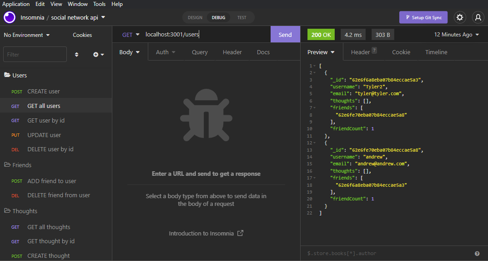

  # Challenge-18: NoSQL Social Media API

  ## Description
  
  This API provides CRUD user/post/post-reaction capabilities for social media websites. This project uses Mongoose, express, and moment.

  ## Table of Contents
  - [Description](#description)
  - [Installation](#installation)
  - [Usage](#usage)
  - [Contributors](#contributors)
  - [Contact](#contact)

  ## Installation
  - Clone the repository to your social media application directory, then run "npm i" and "npm start" in the root directory of this project.
  - Install Insomnia in order to check CRUD operations.

  ## Usage (Local, heroku-deployed)
  - Once installed, Insomnia can then be used to test the CRUD operations on users
 
[Link to walkthrough video](https://youtu.be/wJjRln294rw)

  ## Contributors
  Tyler Flynn

  ## Contact
  [GitHub](https://github.com/tyler94flynn)
  [Email](tyler94flynn@gmail.com)
  